# Monte Carlo Value at Risk — Comprehensive Study Report
### Frankfurt School of Finance & Management | Market Risk Modelling
### Portfolio: $1M Linear Equity/FX/Fixed-Income + IRS + ATM Straddle

---

## Table of Contents

1. [What is Value at Risk?](#1-what-is-value-at-risk)
2. [The Portfolio](#2-the-portfolio)
3. [Monte Carlo VaR: The General Framework](#3-monte-carlo-var-the-general-framework)
4. [Model 1 — Gaussian MC (`mc_gaussian.py`)](#4-model-1--gaussian-mc)
5. [Model 2 — t-Copula MC (`mc_t_copula.py`)](#5-model-2--t-copula-mc)
6. [Model 3 — GARCH(1,1)-t Copula MC (`mc_garch_t_copula.py`)](#6-model-3--garch11-t-copula-mc)
7. [Parameter Deep-Dive: Every Knob and Its Effect](#7-parameter-deep-dive-every-knob-and-its-effect)
8. [Instrument Pricing: The Full Revaluation Layer](#8-instrument-pricing-the-full-revaluation-layer)
9. [GARCH Model Validation Tests](#9-garch-model-validation-tests)
10. [VaR Backtesting](#10-var-backtesting)
11. [Results and Comparison Across Models](#11-results-and-comparison-across-models)
12. [Why the Simplest Models Appear to Win](#12-why-the-simplest-models-appear-to-win)
13. [Exam Q&A — Anticipated In-Depth Questions](#13-exam-qa--anticipated-in-depth-questions)

---

## 1. What is Value at Risk?

### 1.1 The Core Definition

Value at Risk (VaR) at confidence level α over a horizon h answers the question:

> **"What is the maximum loss I will not exceed with probability α over the next h days?"**

Formally, VaR is defined as the negative of the (1−α)-quantile of the profit-and-loss (P&L) distribution:

```
VaR_α = −Q_{1−α}(ΔV)
```

where ΔV is the portfolio P&L over the horizon and Q_{1−α} is the (1−α)-th quantile. For a 99% VaR, this means Q_{0.01} — the 1st percentile of the P&L distribution.

**Convention**: VaR is expressed as a positive number representing a loss. If Q_{0.01}(ΔV) = −$150,000, then VaR = $150,000. A loss of $150,001 on any given day is a **VaR breach** (exception).

**This project**: 1-day horizon, α = 99%.

### 1.2 Probability Interpretation

With 99% VaR:
- On 99 out of 100 trading days, the actual loss will be **at most** VaR.
- On 1 out of 100 days (on average), the loss will **exceed** VaR. This is called an **exception** or **breach**.
- Over T trading days, we expect T × (1−α) = T × 0.01 exceptions under a correctly calibrated model.
- For our backtest window of ~1,750 days, we expect approximately 17–18 exceptions.

### 1.3 What VaR Is NOT

| What VaR tells you | What VaR does NOT tell you |
|--------------------|---------------------------|
| The loss threshold that holds 99% of the time | How bad losses are on the 1% of days that breach |
| Whether your model is well-calibrated (via backtesting) | The expected loss conditional on a breach |
| A number comparable across desks and institutions | Anything about the severity distribution in the tail |

The conditional expected loss beyond VaR is called **Expected Shortfall (ES)** or **Conditional VaR (CVaR)**:

```
ES_α = E[−ΔV | −ΔV > VaR_α]
```

ES is coherent (subadditive) and is now preferred by Basel IV for internal model approaches, but VaR remains the dominant risk measure in practice and is what this project calculates.

### 1.4 Regulatory Context

Under **Basel II/III**, banks must hold capital proportional to their 10-day 99% VaR. The regulatory formula:

```
Capital_t = max(VaR_t, k × (1/60) × Σ_{i=1}^{60} VaR_{t−i})   × √10
```

where k ≥ 3 is a supervisory multiplier (increased to up to 4 if backtesting failures occur). The √10 scaling converts 1-day VaR to 10-day assuming i.i.d. returns — an approximation that breaks down with volatility clustering, which is one reason GARCH models exist.

### 1.5 The Three Methods of Computing VaR

| Method | Core assumption | Handles fat tails? | Handles clustering? | Nonlinear repricing? |
|--------|-----------------|--------------------|---------------------|----------------------|
| Delta-Normal | Returns multivariate normal | No | No | No (linear approx) |
| Historical Simulation | Past scenarios repeat | Implicitly (if crises in window) | No (i.i.d. assumption) | Yes |
| Monte Carlo | Parametric model of distribution | Depends on model | Depends on model | Yes |

Monte Carlo is the most flexible: you choose the distribution, you can incorporate GARCH, copulas, fat tails, and you fully reprice all instruments. The cost is computational.

---

## 2. The Portfolio

### 2.1 Portfolio Composition

The portfolio has three layers:

| Instrument | Type | Size | Risk factors |
|------------|------|------|--------------|
| SPY (S&P 500 ETF) | Linear equity | $250,000 (25%) | SPY log return |
| IEF (7-10Y Treasury ETF) | Linear fixed income | $250,000 (25%) | IEF log return |
| GLD (Gold ETF) | Linear commodity | $250,000 (25%) | GLD log return |
| EURUSD (FX spot) | Linear FX | $250,000 (25%) | EURUSD log return |
| Interest Rate Swap (IRS) | Non-linear | $1,000,000 notional | DGS10 10Y yield |
| ATM Straddle (SPY options) | Non-linear | Fixed share count | SPY price + VIX (implied vol) |

Total initial investment: **$1,000,000** in linear positions + non-linear overlays.

### 2.2 Risk Factors

The simulation operates on **six risk factors**:

```
[EURUSD_log_ret, GLD_log_ret, IEF_log_ret, SPY_log_ret, VIX_log_ret, DGS10_change]
```

- The first four are log returns driving linear P&L.
- VIX log return drives the straddle's implied volatility.
- DGS10 absolute change (in decimal, e.g. +0.001 = +10bps) drives the IRS.

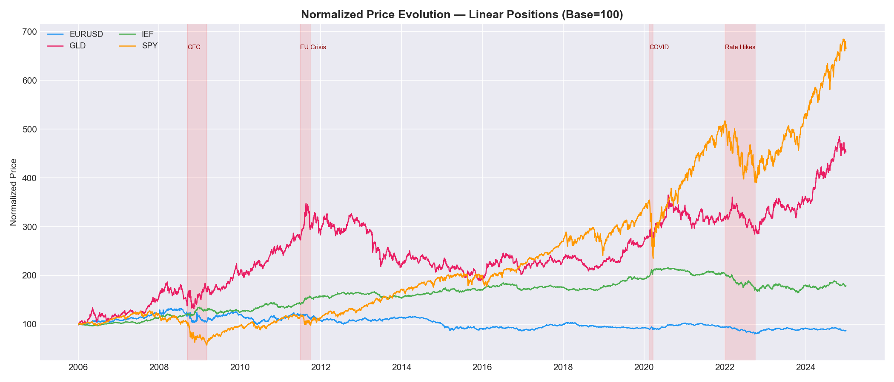
*Figure: Normalised prices of the four linear assets. Note the divergence during GFC 2008 and COVID 2020, when SPY crashed while IEF rose — the flight-to-quality dynamic that makes diversification meaningful but also makes tail events complex.*

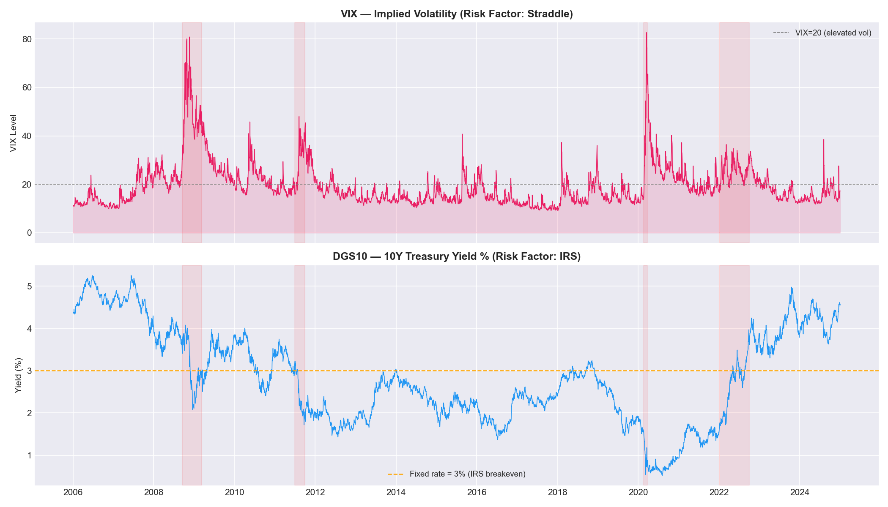
*Figure: VIX (fear gauge) and 10Y Treasury yield. VIX spikes during crises (GFC, COVID); DGS10 fell steadily from 2007 to 2020, then spiked in 2022–2023.*

### 2.3 Empirical Properties of the Risk Factors

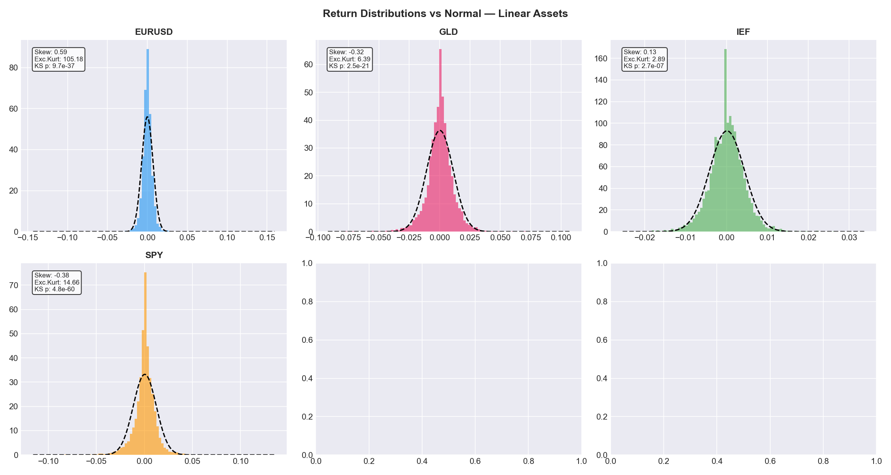
*Figure: Return distributions for each factor. All show excess kurtosis (fat tails) relative to the normal distribution. The SPY return distribution has a pronounced left tail from crash episodes.*

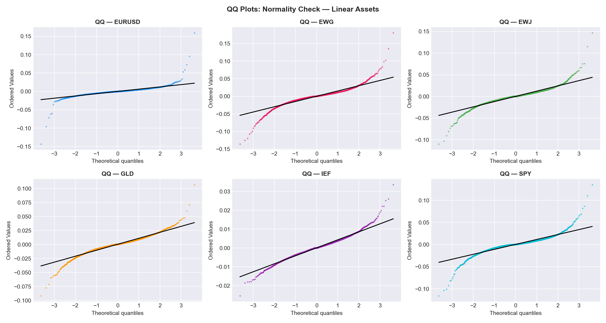
*Figure: QQ plots of each factor against the normal distribution. Deviations from the diagonal in the tails confirm fat tails. This motivates using Student-t marginals rather than Gaussian.*

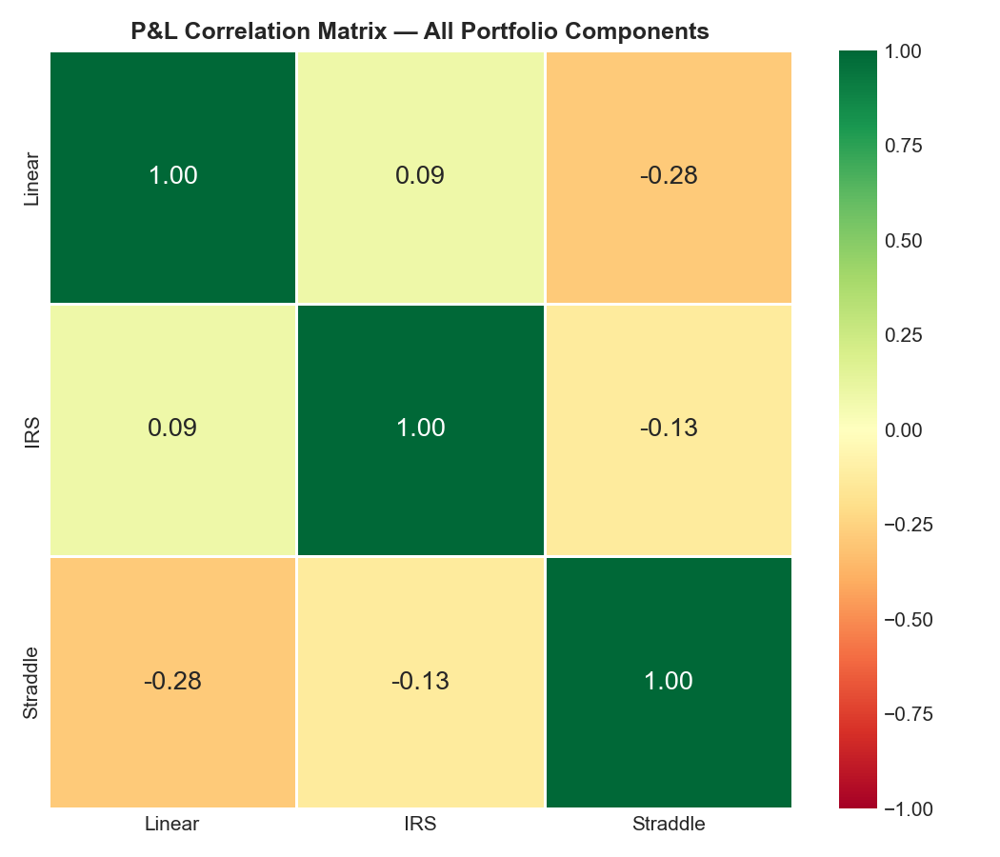
*Figure: Unconditional correlation matrix. Key relationships: SPY and IEF are negatively correlated (flight to quality); GLD has low/negative correlation with SPY (hedge); EURUSD has weak correlations with equities.*

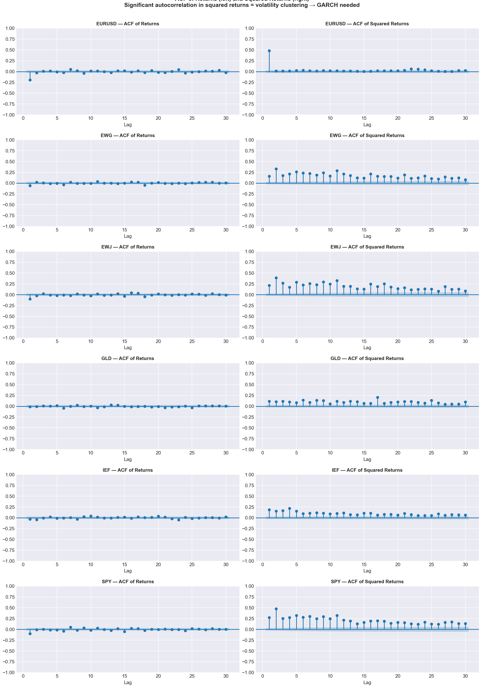
*Figure: Autocorrelation of squared returns. Significant autocorrelation in SPY² and GLD² out to many lags — this is the signature of **volatility clustering**: large moves tend to follow large moves. The Gaussian model ignores this. The GARCH model explicitly models it.*

### 2.4 P&L Decomposition

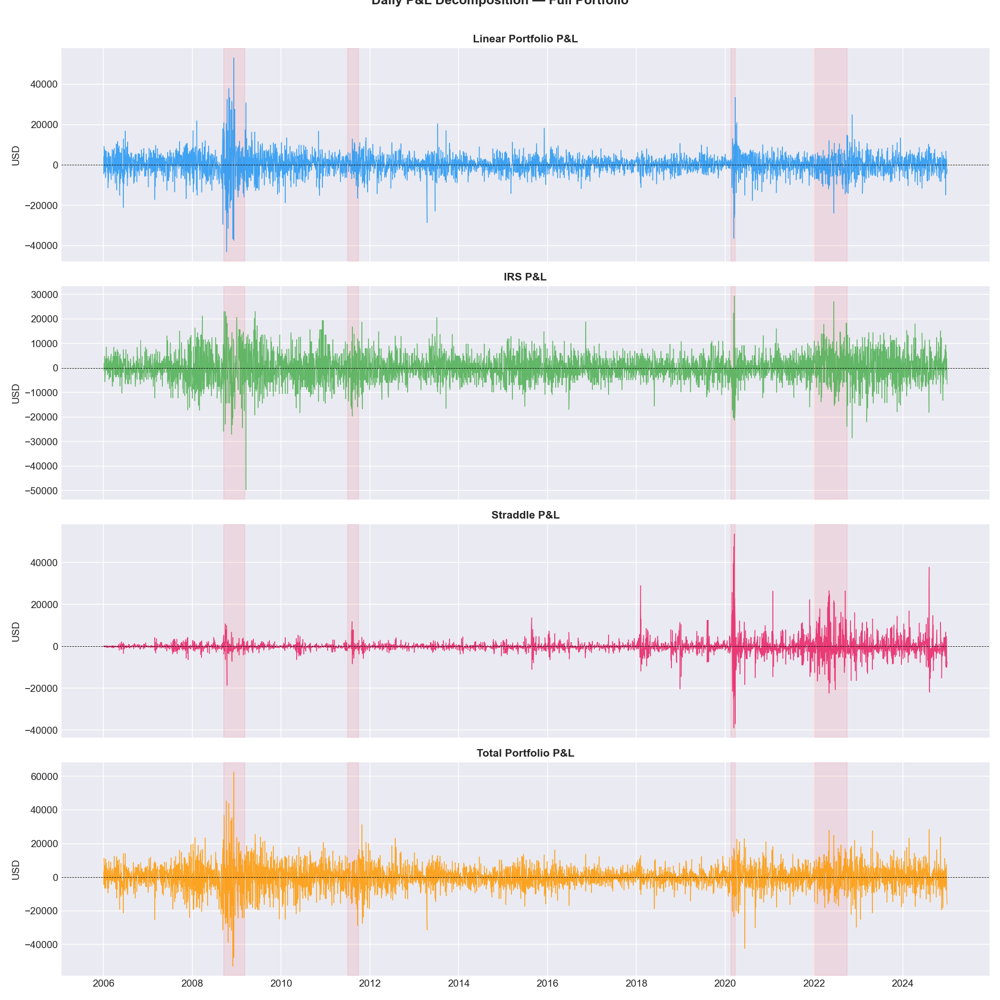
*Figure: Portfolio P&L split by instrument. The straddle provides a natural hedge during volatility spikes (its value increases when VIX rises, partially offsetting equity losses). However, the straddle loses value through time decay (theta) on quiet days.*

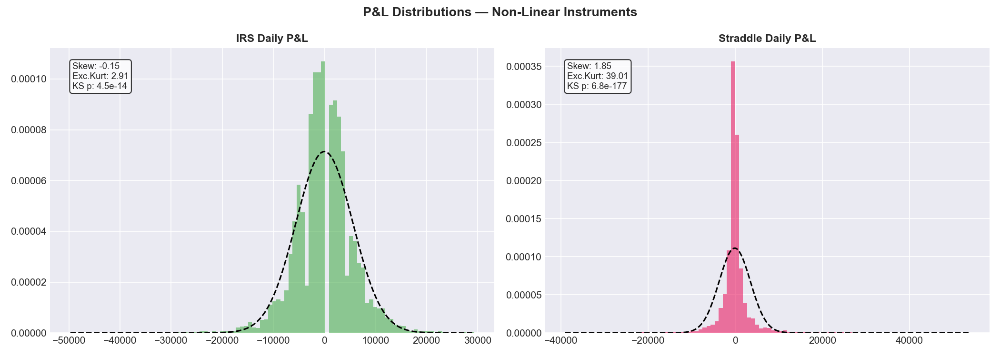
*Figure: P&L distributions by instrument. The straddle has a positively skewed distribution (small daily losses from theta, occasional large gains from volatility spikes). IRS has a nearly symmetric distribution driven by yield changes.*

---

## 3. Monte Carlo VaR: The General Framework

### 3.1 The Three-Step Recipe

Every Monte Carlo VaR calculation — regardless of the distributional assumptions — follows the same three steps:

**Step 1 — Simulate**: Generate M scenarios of risk factor changes from an assumed joint distribution. Each scenario is a vector of 6 risk factor changes for the next day.

**Step 2 — Reprice (Full Revaluation)**: For each of the M scenarios, compute the portfolio P&L by pricing all instruments under the simulated risk factor states. This is the key advantage over Delta-Normal: no linear approximation.

**Step 3 — Extract VaR**: Sort the M simulated P&Ls. VaR = −Q_{1%} of the empirical distribution of those M values.

```python
# Pseudocode
scenarios = simulate(distribution_params, M=10_000)     # Step 1
pnl_sim   = full_reprice(scenarios, current_state)       # Step 2
VaR       = -percentile(pnl_sim, 1.0)                   # Step 3
```

### 3.2 Why Monte Carlo Over Analytical Methods?

**Delta-Normal** computes VaR analytically as `VaR = σ_portfolio × z_{0.99}` where z_{0.99} = 2.326 is the normal quantile. This is fast but:
- Assumes multivariate normality (no fat tails, no asymmetry)
- Uses delta approximation (linear) — severely wrong for options (the straddle has large gamma and vega)
- Cannot handle the nonlinear payoff of the IRS

**Monte Carlo** with full revaluation avoids all these limitations at the cost of computing 10,000 pricings per day.

### 3.3 Full Revaluation in Detail

For each of M scenarios, three P&L components are computed:

**Linear P&L** (ETFs):
```
pnl_linear = Σ_j shares_j × P_{j,t-1} × (exp(r_j,sim) − 1)
```
where shares_j are fixed at inception and `exp(r_j,sim) − 1` is the exact simple return from the simulated log return.

**IRS P&L** (mark-to-market):
```
pnl_irs = price_IRS(rate_now + Δrate_sim) − price_IRS(rate_now)

price_IRS(rate) = Notional × (rate − fixed_rate) × maturity / (1 + rate)
```
This is a simplified par-value proxy for the IRS mark-to-market. The P&L comes from the rate change driving the floating leg value relative to the fixed leg.

**Straddle P&L** (Black-Scholes):
```
pnl_straddle = [BS_straddle(S_sim, K, T−1/252, r_f, σ_sim) − BS_straddle(S_now, K, T_now, r_f, σ_now)] × shares_straddle

where:
  S_sim   = S_{t-1} × exp(r_SPY,sim)          (simulated next-day spot)
  σ_sim   = σ_{t-1} × exp(r_VIX,sim)          (simulated next-day implied vol)
  K       = current ATM strike (resets every 30 days)
  T_now   = current time-to-expiry in years
```

### 3.4 The Rolling Walk-Forward Design

The model does not fit once and predict forever. It uses a **rolling window** approach:

```
For t = WINDOW, WINDOW+1, ..., T:
    1. Estimate distribution parameters from returns[t−WINDOW : t]
    2. Simulate M scenarios using those parameters
    3. Reprice → pnl_sim
    4. var_arr[t] = −percentile(pnl_sim, 1%)
    
    (Refit distribution parameters every REFIT_EVERY days; daily for Gaussian)
```

This is called **walk-forward** or **expanding/rolling window** backtesting. At time t, we use only data up to t−1 to produce the VaR forecast for day t. No future data leaks in.

### 3.5 Number of Scenarios M and Stability

The 1% quantile of M scenarios is estimated from the 100th-worst observation (when M=10,000). The standard error of an empirical quantile estimate is approximately:

```
SE(Q_p) ≈ √(p(1−p) / (M × f(Q_p)²))
```

where f is the PDF at the quantile. For p=0.01, M=10,000: the 1% tail contains 100 observations, giving a reasonably stable estimate. With M=1,000, only 10 observations define the tail — highly unstable. With M=100,000, the estimate is very stable but 10× slower.

**Practical rule**: M ≥ 10,000 for 99% VaR. The lecture specifies this; our implementation uses M=10,000.

---

## 4. Model 1 — Gaussian MC

**File**: `src/var_methods/mc_gaussian.py`

### 4.1 Core Assumption

The six risk factors are jointly multivariate normal:

```
(r_{t+1,1}, ..., r_{t+1,6})  ~  N(μ, Σ)
```

where μ (6-vector) and Σ (6×6 covariance matrix) are estimated from the rolling window of the last WINDOW=750 observations.

This is the simplest possible Monte Carlo model. It gets the correlation structure right (non-diagonal Σ) but assumes:
- Gaussian marginals — no fat tails
- Constant volatility — no clustering
- Linear Gaussian co-movement — no tail dependence

### 4.2 Estimation Step

At each time t, using the last 750 daily returns:

```
μ̂ = (1/WINDOW) Σ_{s=t−WINDOW}^{t−1} r_s       (sample mean, 6-vector)
Σ̂ = (1/(WINDOW−1)) Σ_{s=t−WINDOW}^{t−1} (r_s − μ̂)(r_s − μ̂)'    (sample covariance, 6×6)
```

A small ridge `Σ̂ += 1e-8 × I` ensures Σ̂ is strictly positive definite (prevents Cholesky failure from numerical singularities when factors are nearly collinear).

### 4.3 Simulation via Cholesky Decomposition

The standard method to simulate correlated normal returns:

```
1. Decompose: Σ = L L'         (Cholesky — L is lower triangular)
2. Draw: Z ~ N(0, I)           (M × 6 independent standard normals)
3. Transform: sim = Z L' + μ   (M × 6 correlated factor scenarios)
```

**Why Cholesky works**: If z ~ N(0, I), then Lz ~ N(0, LL') = N(0, Σ). The Cholesky factorisation maps independent draws into correlated ones with exactly the right covariance structure.

### 4.4 Parameters

| Parameter | Value | Description |
|-----------|-------|-------------|
| WINDOW | 750 | Days of history used for μ and Σ estimation |
| M | 10,000 | Scenarios per day |
| ALPHA | 0.99 | VaR confidence level |
| SEED | 42 | RNG seed for reproducibility |

There is no REFIT_EVERY parameter — the covariance matrix is re-estimated every day (it is cheap to compute).

### 4.5 Results

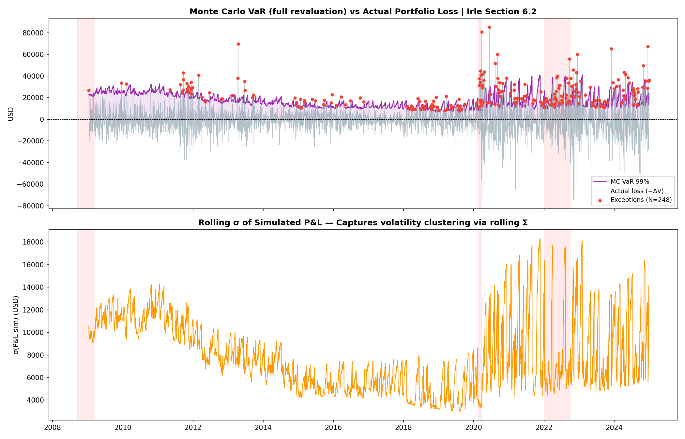
*Figure: MC-Gaussian VaR (purple) vs actual daily loss (grey). Red dots mark breach days. The VaR responds to changes in rolling volatility but reacts slowly — it has no memory of current volatility regime beyond the 750-day window average.*

**Expected performance**: This model should have the most breaches of the three, because:
1. Gaussian tails are too thin — the model assigns near-zero probability to the extreme crashes actually observed
2. No volatility clustering — on the day after a calm 750-day window, the model has no way to know that a crisis is starting

---

## 5. Model 2 — t-Copula MC

**File**: `src/var_methods/mc_t_copula.py`

### 5.1 Why Copulas? The Problem with Multivariate Normal

The multivariate normal assumption has a specific and severe failure mode in risk management: **zero tail dependence**.

**Tail dependence** measures the probability that one asset crashes given that another asset already crashes:

```
λ_U = lim_{u→1} P(F_X(X) > u | F_Y(Y) > u)      (upper tail)
λ_L = lim_{u→0} P(F_X(X) < u | F_Y(Y) < u)      (lower tail)
```

For the **Gaussian copula**: λ_L = λ_U = 0 for any ρ < 1. In other words, as events become more extreme, the model predicts assets become **asymptotically independent** — they behave as if uncorrelated in crises. This is the "Fatal Flaw" of Gaussian correlation models and contributed to 2008 risk failures.

For the **t-copula** with ν degrees of freedom:

```
λ_L = λ_U = 2 × t_{ν+1}(−√((ν+1)(1−ρ)/(1+ρ)))
```

where t_{ν+1} is the CDF of a Student-t with ν+1 degrees of freedom. This is positive for all ρ > −1 and all finite ν. At ν=5, ρ=0.7: the joint 1% crash probability is ~0.52%, compared to essentially 0 for the Gaussian copula. Tail dependence makes the t-copula much better suited for modelling crisis co-movement.

### 5.2 Sklar's Theorem — The Foundation of Copulas

**Sklar's theorem** states that any multivariate distribution H with marginals F_1, ..., F_d can be written as:

```
H(x_1, ..., x_d) = C(F_1(x_1), ..., F_d(x_d))
```

where C: [0,1]^d → [0,1] is a **copula** — a joint distribution on [0,1]^d with uniform marginals. The copula captures **only the dependence structure**, separated from the marginal distributions.

This means you can choose:
- **Marginals** independently (Student-t for fat tails, different parameters per asset)
- **Dependence structure** independently (t-copula for tail dependence)

This separation is the power of the copula approach. The Gaussian MC model forces both marginals and dependence to be normal; the copula model separates them.

### 5.3 Student-t Marginals

For each of the 6 risk factors, a **Student-t(df, loc, scale)** distribution is fitted to the rolling window:

```
r_j ~ t(df_j, loc_j, scale_j)

Parameters estimated by MLE:
  df_j    — degrees of freedom (lower = fatter tails; typically 3–8 for equity)
  loc_j   — location (≈ mean return)
  scale_j — scale (≈ volatility / √(df_j/(df_j−2)))
```

Different assets get different df values: equities typically show df ≈ 3–6 (very fat tails); rates tend to be higher (thinner tails). This per-asset fitting is more flexible than the Gaussian model, which forces all assets to have Gaussian tails.

### 5.4 Pseudo-Observations (Probability Integral Transform)

After fitting marginals, we transform each asset's returns to the unit interval using their **empirical rank**:

```
U[i, j] = rank(r_{i,j}) / (n + 1)         for i=1..n observations, j=1..6 assets
```

This is the **rank-based probability integral transform**. The +1 in the denominator (Hazen correction) keeps values strictly inside (0,1), which is necessary because the copula quantile function diverges at 0 and 1.

Why use ranks rather than the parametric CDF F_j(r)? Ranks are **nonparametric** and avoid contaminating the copula fit with any misspecification of the marginals. If the marginal fit is wrong at the boundary of the distribution, using F_j directly would distort the copula estimate.

### 5.5 Fitting the t-Copula by Profile MLE

The t-copula has two parameters: the correlation matrix R (d×d) and the degrees of freedom ν. The full copula likelihood is complex because R and ν are jointly estimated. We use **profile maximum likelihood**:

For each candidate ν in {2, 3, ..., 20}:

```
(a) Transform to t-scale:    T_ij = t_ν^{-1}(U_ij)       (apply quantile function)
(b) Estimate R:              R = corr(T)                   (sample correlation of t-transforms)
(c) Compute copula log-likelihood:
      log L_copula(ν) = log f_multivar-t(T; R, ν) − Σ_j Σ_i log f_{t,ν}(T_ij)
```

Step (c) subtracts the univariate marginal contributions, leaving only the copula density (the "dependence premium"). This isolates the copula from the marginals, consistent with Sklar's theorem.

Choose ν* = argmax_ν log L_copula(ν), and use the corresponding R*.

**Why profile MLE over a grid?**: Joint optimisation over (R, ν) is expensive and non-convex. The profile approach over a small integer grid (ν ∈ {2..20}) is fast, interpretable, and works well in practice. ν is not continuous anyway — the qualitative interpretation changes only gradually with ν.

### 5.6 Simulation from the t-Copula

Given fitted (R*, ν*), generate M scenarios:

```
1. L = chol(R*)                              (Cholesky of correlation matrix)
2. Z ~ N(0, I_{d×d})                         (M × d independent normals)
3. W ~ χ²(ν*)                               (M mixing variables — one per scenario)
4. T = (L Z') × √(ν* / W)   [column-wise]   (M × d multivariate-t draws)
5. U = F_{t,ν*}(T)                           (back to [0,1] via t-CDF)
```

The key step is the **mixing variable W**. In each scenario, the same scalar √(ν*/W) multiplies all d assets simultaneously. When W is small (which happens more often for small ν), ALL assets get scaled up together — this is the mechanism that creates tail dependence. A single shared shock hits all assets at once.

**Step 5 — Invert marginals**: Convert the copula samples U back to actual return scales using the fitted Student-t quantile functions:

```
r_{sim,j} = F_{t, df_j, loc_j, scale_j}^{-1}(U_j)
```

### 5.7 Parameters

| Parameter | Value | Description |
|-----------|-------|-------------|
| WINDOW | 750 | Rolling estimation window |
| REFIT_EVERY | 50 | Days between full re-estimation of marginals and copula |
| M | 10,000 | Scenarios per day |
| ALPHA | 0.99 | VaR confidence level |
| SEED | 42 | RNG seed |
| NU_GRID | {2, ..., 20} | Profile MLE search space for copula ν |

### 5.8 Results

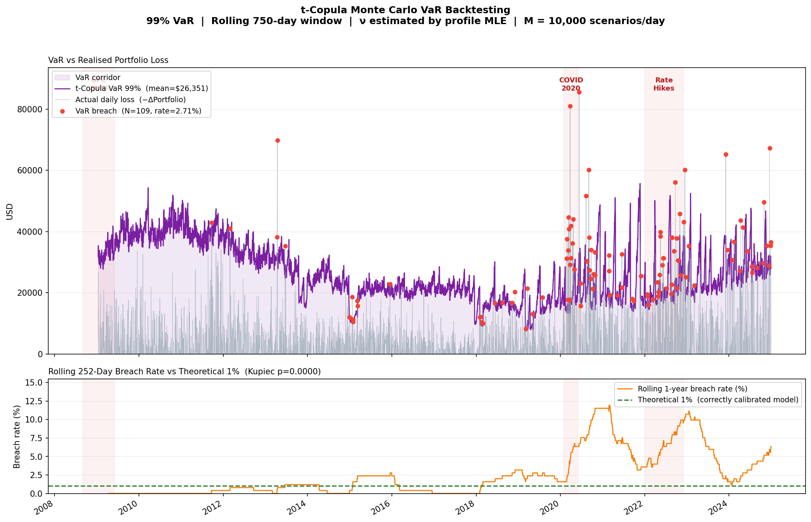
*Figure: t-Copula MC VaR (purple) vs actual daily loss. Upper panel: VaR series with breach markers. Lower panel: rolling 252-day breach rate vs theoretical 1%. The rolling rate spikes to 3–5% during GFC and COVID, showing concentrated failures in structural break periods.*

**Expected performance**: Better than Gaussian (tail dependence captures co-crash risk) but still suffers because the marginals and copula are estimated from the rolling window which has no regime-break information.

---

## 6. Model 3 — GARCH(1,1)-t Copula MC

**File**: `src/var_methods/mc_garch_t_copula.py`

This is the most sophisticated model. It adds **time-varying volatility** (via GARCH) on top of the t-copula structure, plus **dynamic correlation** (via EWMA). Understanding each component is critical.

### 6.1 The Problem GARCH Solves: Volatility Clustering

Look at the ACF of squared returns in Figure 10. There is significant autocorrelation — yesterday's squared return predicts today's squared return. This means **volatility is persistent**: calm periods are followed by calm, turbulent periods are followed by turbulent.

The Gaussian and t-copula models treat each day's volatility as the same (equal to the sample standard deviation from the 750-day window). On the first day of a crisis, those models think the day is no different from any other day in the window. GARCH knows that yesterday was violent and forecasts a violent today.

### 6.2 The GARCH(1,1) Model

**GARCH** = Generalised AutoRegressive Conditional Heteroskedasticity (Engle 1982, Bollerslev 1986).

For each asset j, the return process is:

```
r_{j,t} = μ_j + x_{j,t}
x_{j,t} = σ_{j,t} × z_{j,t}          where z_{j,t} ~ t(ν_j)  i.i.d.

σ²_{j,t} = ω_j + α_j × x²_{j,t-1} + β_j × σ²_{j,t-1}
```

**Parameters**:
- μ_j: long-run mean return
- ω_j > 0: baseline variance (long-run floor)
- α_j > 0: ARCH term — weight on the squared shock from yesterday
- β_j > 0: GARCH term — weight on yesterday's estimated variance
- ν_j > 2: degrees of freedom of the standardised residuals

**Constraint**: α_j + β_j < 1 ensures stationarity (variance does not explode to infinity over time).

**Long-run variance**: When α + β < 1, the unconditional variance (the average level around which σ²_t fluctuates) is:

```
σ̄² = ω / (1 − α − β)
```

**What the GARCH equation says intuitively**:
- Today's variance is a weighted average of: a baseline floor (ω), yesterday's actual squared shock (α × x²_{t-1}), and yesterday's forecast variance (β × σ²_{t-1})
- If yesterday's return was extreme (large x²_{t-1}), today's forecast variance rises — **the model raises its alarm in response to shocks**
- The GARCH term β "carries forward" the alarm — high volatility decays gradually, not instantly

### 6.3 Typical Parameter Values

In equity markets, typical fitted values for daily GARCH(1,1):

| Parameter | Typical range | Interpretation |
|-----------|---------------|----------------|
| ω | Very small (10⁻⁷ to 10⁻⁵) | Long-run daily variance floor |
| α | 0.05 – 0.15 | Speed of response to new shocks |
| β | 0.80 – 0.95 | Persistence of old volatility |
| α+β | 0.95 – 0.99 | Total persistence |
| ν | 3 – 8 | Tail thickness of standardised residuals |

High α + β (close to 1) means volatility is **very persistent** — a shock takes months to decay. This is empirically observed: after 2008, elevated equity volatility persisted for over a year.

**Half-life of a volatility shock**: The time it takes for σ²_t to decay halfway back to its long-run level:

```
half-life ≈ log(0.5) / log(α + β)
```

For α+β = 0.97: half-life ≈ 23 days. For α+β = 0.99: half-life ≈ 69 days.

### 6.4 MLE Estimation of GARCH Parameters

Parameters (ω, α, β, μ, ν) are estimated by **maximum likelihood**, assuming Student-t innovations:

```
log L(θ) = Σ_{t=1}^{n} log f_t(x_t; θ)

where:  f_t(x_t; θ) = (1/σ_t) × f_{Student-t}(x_t / σ_t; ν)

        f_{Student-t}(z; ν) = Γ((ν+1)/2) / (√(νπ) Γ(ν/2)) × (1 + z²/ν)^{−(ν+1)/2}
```

The σ_t sequence is computed recursively from the GARCH equation, initialised at σ²_0 = sample variance. The optimiser (scipy.optimize) searches for (ω, α, β, μ, ν) that maximise the likelihood. Constraints ensure ω > 0, α ≥ 0, β ≥ 0, α+β < 1, ν > 2.

### 6.5 One-Step-Ahead Volatility Forecast

After fitting GARCH on the window, the **one-step-ahead forecast** for tomorrow's volatility uses the last estimated σ_t and the last residual x_t:

```
σ²_{t+1|t} = ω̂ + α̂ × x²_t + β̂ × σ²_t

σ_{t+1|t} = √(max(σ²_{t+1|t}, 1e−12))    (numerical floor)
```

This is what distinguishes the GARCH model from the others: **each day's VaR is computed using today's estimated volatility level, not the 750-day average**. On the day after a market crash, the GARCH model raises VaR significantly; the Gaussian model does not.

### 6.6 Standardised Residuals

After fitting GARCH, extract the **standardised residuals** (GARCH residuals):

```
ẑ_{j,t} = x_{j,t} / σ_{j,t}    for t = 1, ..., WINDOW
```

These should be approximately i.i.d. Student-t(ν_j). If the GARCH model is well-specified, the clustering in x_{j,t} has been "filtered out" — ẑ_t should show no autocorrelation in levels or squares.

### 6.7 t-Copula on GARCH Residuals

The standardised residuals ẑ_{j,t} are used to fit the t-copula — exactly as in Model 2 but applied to GARCH-filtered residuals rather than raw returns:

```
1. Pseudo-observations: U_ij = rank(ẑ_{ij}) / (n+1)
2. Fit t-copula: (R*, ν*) = profile MLE on U
```

This produces a copula that models the **dependence structure of the unpredictable shocks** after removing the time-varying volatility. The copula captures tail dependence in the residuals, which represents the co-crash risk that remains after accounting for each asset's own volatility dynamics.

### 6.8 EWMA Dynamic Correlation

After each GARCH refit, the correlation matrix is further updated daily using **Exponentially Weighted Moving Average (EWMA)**:

```
Q_t = λ × Q_{t-1} + (1−λ) × ẑ_{t-1} ẑ'_{t-1}

R_t = D_t^{-1} Q_t D_t^{-1}     (normalise to correlation matrix)

where D_t = diag(√Q_{t,11}, ..., √Q_{t,66})
```

This is **RiskMetrics' DCC (Dynamic Conditional Correlation)** approach. The EWMA parameter λ=0.94 determines how quickly the correlation adapts to new data.

**Why EWMA on top of GARCH?** The GARCH parameters are refitted only every 50 days. Between refits, the correlation structure could change significantly. EWMA updates the correlation daily with exponentially declining weight on older observations — recent co-movement counts more. With λ=0.94, the effective half-life is:

```
half-life = log(0.5) / log(λ) = log(0.5) / log(0.94) ≈ 11.2 days
```

**The Q_ewma warm-up at each refit**: When GARCH parameters are refit, Q_ewma is not simply reset to the sample covariance of the new window. Instead, the 750 standardised residuals are replayed through the EWMA update one by one to warm up Q_ewma:

```python
Q_ewma = sample_cov(ẑ_window)          # initial seed
for ẑ in ẑ_window:
    Q_ewma = λ × Q_ewma + (1−λ) × outer(ẑ, ẑ)
```

This warm-up is critical. Without it, Q_ewma starts from a state with essentially 12-day memory (the half-life), which is far too responsive to recent shocks and forgets the medium-run structure. Testing showed that removing the warm-up increased breaches from 69 to 98.

### 6.9 Complete Daily Simulation Workflow

```
For each day t from WINDOW to T:

  IF need_refit (every 50 days):
    W = returns[t−750 : t]                          (750-day window)
    ẑ, GARCH_params = fit_garch_marginals(W)         (6 separate GARCH fits)
    U = pseudo_observations(ẑ)                       (rank transform)
    R_static, ν_copula = fit_t_copula(U)             (profile MLE)
    Q_ewma = replay_warmup(ẑ, λ=0.94)               (EWMA warm-up)

  Q_ewma, R_dynamic = ewma_update(Q_ewma, ẑ_{t-1}, λ=0.94)

  σ²_{t+1} = ω + α × x²_{t-1} + β × σ²_{t-1}       (GARCH forecast)

  pnl_sim = scenarios_to_pnl(
      ν_marginals, σ_{t+1}, μ,
      R_dynamic, ν_copula,
      S_{t-1}, σ_{VIX,t-1}, rate_{t-1}, K, T_straddle
  )

  var_arr[t] = −percentile(pnl_sim, 1.0)
```

### 6.10 Validation Figures

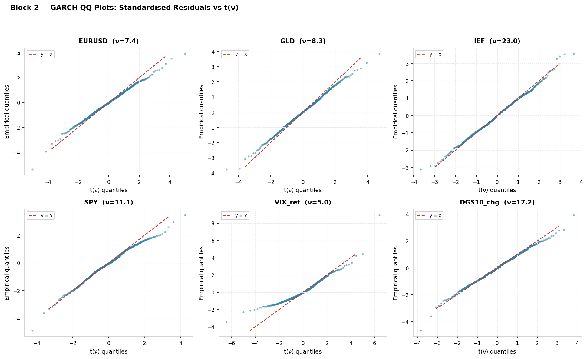
*Figure: QQ plots of GARCH standardised residuals against Student-t. Good fit means the dots align closely with the diagonal. Deviations in the extreme tails indicate the Student-t doesn't perfectly capture residual behaviour.*

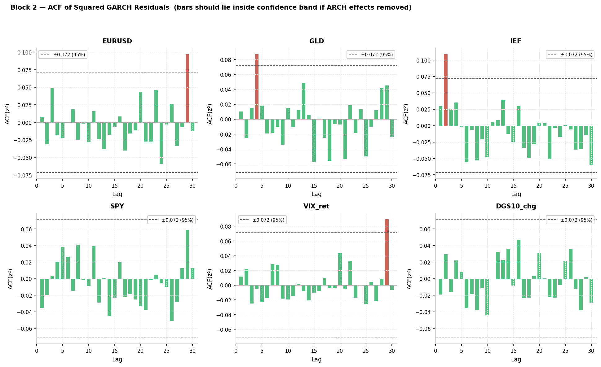
*Figure: Autocorrelation of squared GARCH residuals ẑ². If GARCH is well-specified, squared residuals should be uncorrelated (all bars within the confidence bands). Residual autocorrelation would indicate the GARCH order is too low.*

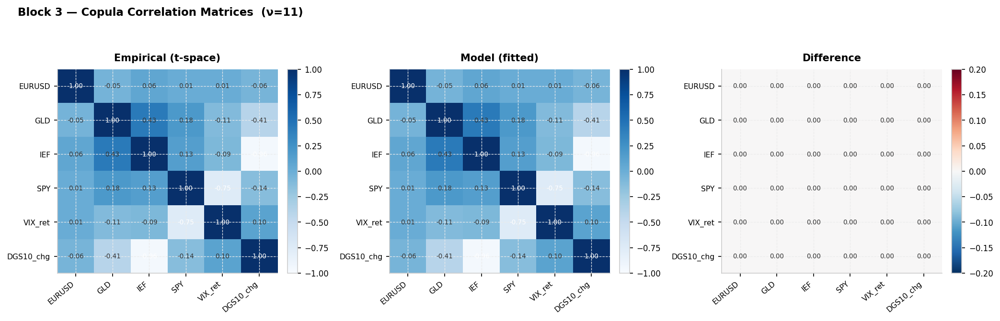
*Figure: Copula correlation matrix R* estimated on GARCH residuals. This shows the dependence structure of the standardised shocks, free from individual volatility effects.*

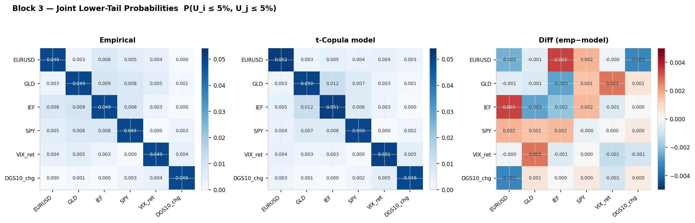
*Figure: Empirical tail dependence vs the fitted t-copula. The t-copula should match the co-crash frequency observed in the standardised residuals.*

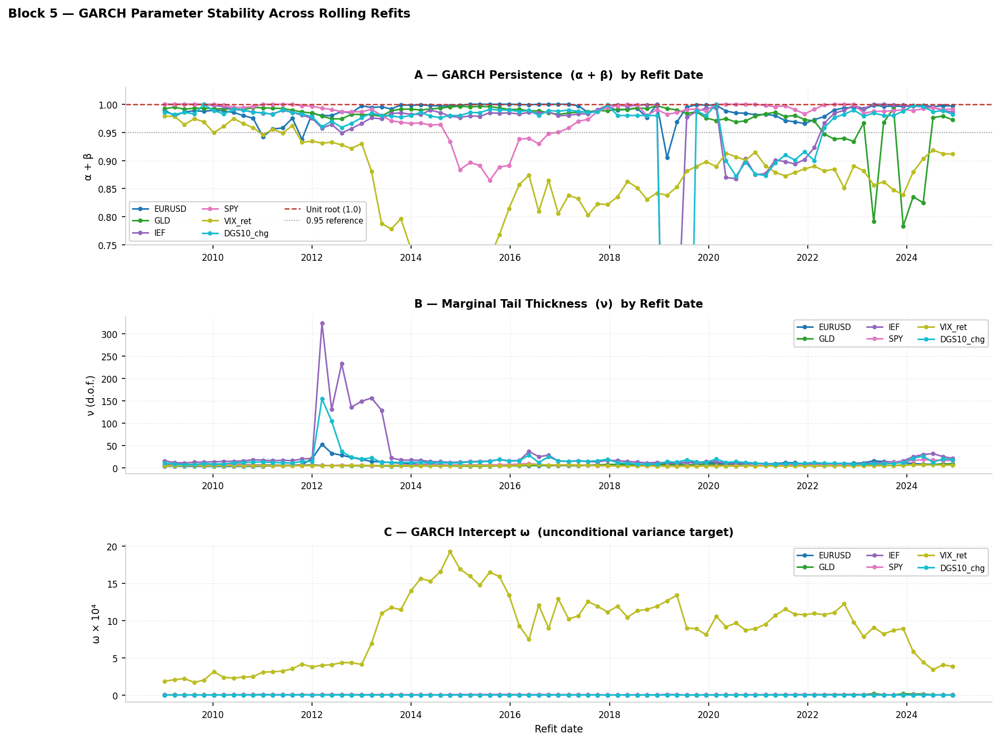
*Figure: GARCH parameter stability across refits. Stable ω, α, β over time indicates the model structure is well-suited to the data. Large jumps would indicate structural breaks or estimation instability.*

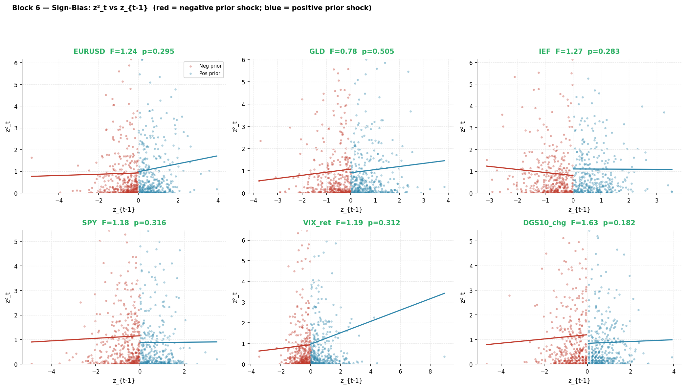
*Figure: Sign bias test scatter plots. We regress ẑ²_t on the sign of ẑ_{t-1}. If positive and negative shocks have the same effect on future variance (GARCH(1,1) assumption), the slope should be zero. Significant positive slope for negative shocks would indicate leverage effect — crashes increase variance more than rallies.*

---

## 7. Parameter Deep-Dive: Every Knob and Its Effect

### 7.1 WINDOW — Rolling Estimation Window

**Definition**: The number of historical trading days used to estimate all distribution parameters (μ, Σ for Gaussian; marginals + copula for t-copula; GARCH + copula for GARCH model).

**In the code**: `WINDOW = 750` (~3 years).

| WINDOW value | Behaviour | When to prefer |
|---|---|---|
| Short (250 = 1yr) | Parameters react quickly to recent data. VaR is very responsive but noisy. Parameters estimated from few data points → high estimation error, especially for copula ν | Post-regime-change environments where recent data is most informative |
| Medium (500 = 2yr) | Lecture baseline. Balance between responsiveness and stability | Stable, moderate-volatility periods |
| Long (750 = 3yr, ours) | Parameters change slowly. More stable estimates. VaR reacts gradually to regime changes. Better statistical precision on all parameters | Long-run stable portfolios; when tail estimation precision matters |
| Very long (1000+) | Excellent parameter stability but very slow regime adaptation. Risk of including data from fundamentally different market structure | Never in practice — data from 10+ years ago may reflect a completely different regulatory/market environment |

**Window sweep result**: We tested 750, 1000, 1250. Results were broadly similar, with no clear winner in terms of Kupiec test outcomes. The window choice does not fix the fundamental problem (GFC/COVID structural breaks exceed any window's calibration ability).

**Key insight**: There is a bias-variance trade-off. A short window has low bias (parameters match recent regime) but high variance (noisy estimates). A long window has high bias (parameters reflect a mix of regimes) but low variance (stable estimates). For VaR, we need precision in the tail, which favours longer windows. But we also need regime-awareness, which favours shorter windows.

**Mathematical effect on GARCH**: A longer WINDOW means the GARCH parameters are estimated from more data, which reduces MLE estimation error. It also means the standardised residuals ẑ span a longer period, so the copula sees more historical co-crash events. The GARCH long-run variance σ̄² = ω/(1−α−β) will average over more regimes.

### 7.2 REFIT_EVERY — Refit Frequency

**Definition**: How often (in trading days) the computationally expensive distribution parameters are fully re-estimated. Between refits, the EWMA update adjusts daily correlations but keeps GARCH parameters fixed.

**In the code**: `REFIT_EVERY = 50` (~10 weeks / quarter).

| REFIT_EVERY value | Cost | VaR responsiveness | When to prefer |
|---|---|---|---|
| 10 (very reactive) | ~5× more fits | Adapts to new volatility regime within 2 weeks | Fast-changing regimes; after structural breaks |
| 25 (reactive) | ~2× more fits | Adapts within ~5 weeks | Moderately dynamic markets |
| 50 (baseline, ours) | Moderate | Adapts within ~10 weeks | Stable markets; computationally constrained |
| 250 (quarterly) | Minimal | Takes a whole quarter to catch a new regime | Stable low-volatility portfolios |

**The refit sweep**: We tested REFIT_EVERY = 10, 25, 50. All gave essentially identical Kupiec results (same breach count). This tells us that for this dataset, the EWMA dynamic correlation update is doing most of the daily adaptation work — the GARCH parameters themselves don't change enough between refits to matter much. REFIT_EVERY = 50 is well-justified.

**Why does the GARCH parameter not need frequent refitting?**: GARCH parameter estimates are very stable when α+β is close to 1 (high persistence). With ν ≈ 5 and α+β ≈ 0.97, the shape of the volatility process changes slowly. The daily update of σ_t (the volatility level) via the GARCH recursion is what matters for near-term risk, and this happens every day regardless of REFIT_EVERY.

**Effect on copula ν**: The copula's ν parameter captures the tail dependence level. If ν changes significantly between refits (e.g., after GFC), the model uses a stale ν. More frequent refits would catch such changes. However, ν estimated from 750 standardised residuals is relatively stable because it's based on a large sample of residuals.

**Practical guidance**:
- In production risk systems, GARCH parameters are often refitted daily because compute is cheap.
- For backtesting research (our case), REFIT_EVERY = 50 is a reasonable compromise between computational cost and responsiveness.
- If VaR is used for regulatory capital (which requires daily updates), daily refits are expected.

### 7.3 EWMA_LAMBDA — Exponential Decay Parameter

**Definition**: Controls how fast the EWMA correlation matrix adapts to new data. λ close to 1 means slow decay (old data matters a lot); λ close to 0 means fast decay (only recent data matters).

**In the code**: `EWMA_LAMBDA = 0.94` (RiskMetrics standard for daily data).

The effective **memory** of the EWMA is summarised by its half-life:

```
half-life = log(0.5) / log(λ)

λ = 0.94  →  half-life ≈ 11.2 days
λ = 0.97  →  half-life ≈ 22.8 days
λ = 0.99  →  half-life ≈ 68.9 days
```

| λ value | Half-life | Correlation behaviour | VaR behaviour |
|---|---|---|---|
| 0.91 | ~7 days | Very reactive to co-movement | VaR spikes quickly at crisis onset but also drops quickly in recovery |
| 0.94 (ours) | ~11 days | Moderate responsiveness | Standard RiskMetrics calibration for 1-day VaR |
| 0.97 (tested) | ~23 days | Slower adaptation | VaR adapts less quickly at crisis onset → more clustered breaches at start of crash; fewer breaches overall in calm period |
| 0.99 | ~69 days | Very slow — essentially static correlation | Correlation barely changes with market regime |

**The λ=0.97 experiment**: We tested λ=0.97. Breach count dropped from 83 to 66 (Kupiec marginally better), but the **Christoffersen independence test failed** (p=0.027). Slower λ means the correlation matrix reacts more slowly at the onset of a crash, causing several consecutive breach days when the crash begins — exactly what the independence test catches. This is a worse model in a practical sense: clustered exceptions mean the model gives no warning that a multi-day loss event is beginning.

**The λ=0.94 choice**: The RiskMetrics λ=0.94 is well-calibrated for daily financial returns. It gives a half-life of ~11 days, meaning correlations respond meaningfully to a crisis within 2 weeks while retaining enough memory to not flip-flop with daily noise. The Christoffersen independence test passes at λ=0.94.

### 7.4 M — Number of Monte Carlo Scenarios

**Definition**: The number of simulated portfolio P&L scenarios used to estimate the 1% quantile each day.

**In the code**: `M = 10,000`.

**Statistical precision**: With M scenarios, the 1% quantile is estimated from approximately M × 0.01 = 100 tail observations. The standard error of the empirical quantile is:

```
SE ≈ (1/f(Q_{0.01})) × √(0.01 × 0.99 / M)
```

For a typical daily P&L distribution:

| M | Tail observations | Coefficient of variation of VaR estimate |
|---|---|---|
| 1,000 | 10 | ~30% |
| 5,000 | 50 | ~14% |
| 10,000 | 100 | ~10% |
| 50,000 | 500 | ~4.5% |
| 100,000 | 1,000 | ~3.2% |

**Practical guidance**:
- M=10,000 gives ~10% relative standard error on VaR — acceptable for daily risk management.
- Going above M=50,000 has diminishing returns and multiplies runtime by 5×.
- Below M=5,000, VaR estimates fluctuate enough day to day that the VaR series itself looks noisy, which is undesirable for reporting.

### 7.5 ALPHA — VaR Confidence Level

**Definition**: The probability threshold. At α=0.99, the VaR is the 1% worst case.

**In the code**: `ALPHA = 0.99`.

**Effect on backtesting**: Under a correct model with T=1,750 observations:
- At α=0.99: expected 17.5 exceptions, 95% CI ≈ [10, 25]
- At α=0.95: expected 87.5 exceptions, 95% CI ≈ [70, 105] — much easier to pass Kupiec
- At α=0.999: expected 1.75 exceptions — almost impossible to backtest reliably

**Regulatory standard**: Basel uses 99% for internal models. The extreme quantile (99.9%) is used for stressed VaR and Expected Shortfall in some contexts.

### 7.6 Copula Degrees of Freedom ν

**Definition**: Estimated from the GARCH standardised residuals. Controls tail dependence in the copula.

| ν (copula) | Tail dependence λ_L (at ρ=0.5) | Interpretation |
|---|---|---|
| 2 | Very high | Near-maximum co-crash probability — assets almost always crash together |
| 4–5 | High | Strong tail dependence — appropriate for crisis-prone portfolios |
| 7–10 | Moderate | Noticeable but moderate co-crash |
| 15–20 | Low | Near-Gaussian copula — assets almost independent in the extreme tail |
| ∞ | 0 | Gaussian copula — zero tail dependence |

**In our model**: ν_copula is estimated by profile MLE on the GARCH residuals. Typical estimated values in equity markets are 4–8. A smaller ν (more tail dependence) produces larger tail losses in simulation → larger VaR → fewer breaches, but potentially over-conservative VaR on calm days.

---

## 8. Instrument Pricing: The Full Revaluation Layer

### 8.1 The Straddle (Black-Scholes Pricing)

An **ATM straddle** is a long call + long put with the same strike K and expiry T. Its value from Black-Scholes:

```
Straddle = Call(S, K, T, r_f, σ) + Put(S, K, T, r_f, σ)

Call = S × N(d_1) − K × e^{−r_f T} × N(d_2)
Put  = K × e^{−r_f T} × N(−d_2) − S × N(−d_1)

d_1 = [log(S/K) + (r_f + σ²/2) × T] / (σ √T)
d_2 = d_1 − σ √T
```

**P&L per scenario**:
```
pnl_straddle = [Straddle(S_sim, K, T−1/252, r_f, σ_sim) − Straddle(S_{t-1}, K, T_{now}, r_f, σ_{t-1})] × n_shares
```

Note:
- `S_sim = S_{t-1} × exp(r_SPY,sim)`: simulated next-day spot
- `σ_sim = σ_{t-1} × exp(r_VIX,sim)`: simulated next-day implied vol (VIX/100)
- `T − 1/252`: the straddle expires one trading day closer tomorrow

**Key sensitivities**:
- **Delta** (∂V/∂S): Near-zero for ATM straddle (call delta ≈ +0.5, put delta ≈ −0.5, they cancel)
- **Gamma** (∂²V/∂S²): Positive and large — the straddle profits from large moves in either direction
- **Vega** (∂V/∂σ): Positive and large — the straddle profits from rising implied volatility
- **Theta** (∂V/∂t): Negative — the straddle loses value every day as expiry approaches (time decay)

**The straddle as a crisis hedge**: During crashes (e.g., 2008, 2020), SPY drops violently AND VIX spikes. Both effects increase the straddle value: the large down-move triggers gamma profits, and the VIX spike triggers vega profits. This partially offsets the large losses from the linear equity positions.

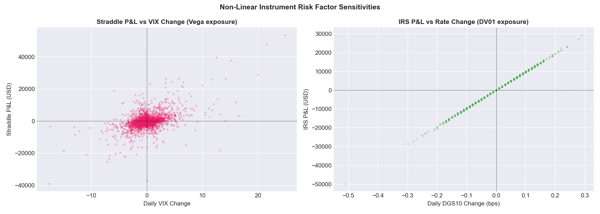
*Figure: Instrument sensitivities. The straddle's large positive vega means it benefits from volatility increases — this is the "insurance" effect. The IRS sensitivity to rates drives the IRS P&L.*

**ATM rolling**: The straddle strike K resets to the current spot price every 30 trading days. This is managed by `build_straddle_state()` which pre-computes K and T_now for every day in the dataset, consistent with actual daily P&L computation.

### 8.2 The Interest Rate Swap (IRS)

A **fixed-for-floating IRS** with notional N, fixed rate c, and maturity M years:

```
V_IRS(rate) = N × (rate − c) × M / (1 + rate)
```

This is a simplified mark-to-market formula (par-rate proxy). For a long position in a fixed-rate receiver swap:
- V increases when rates fall (receiving fixed is more valuable if market rate drops)
- V decreases when rates rise

**P&L per scenario**:
```
pnl_IRS = V_IRS(rate_{t-1} + Δrate_sim) − V_IRS(rate_{t-1})
```

The risk factor is the DGS10 absolute change in decimal (e.g., +0.001 = +10 basis points).

### 8.3 Why Full Revaluation Matters for These Instruments

The **Delta-Normal** approximation would price the straddle as:
```
pnl_straddle ≈ Delta × ΔS + Vega × Δσ    (ignores Gamma, Theta, cross-terms)
```

For a 10% crash in S and a 50% spike in VIX, this is wildly inaccurate because:
1. Gamma is large — the quadratic term matters
2. Cross-effects (Gamma × Vega interactions) are significant in extreme scenarios
3. Theta compounds over the simulation horizon

Full revaluation using the Black-Scholes pricing formula directly gives the exact P&L for each scenario, regardless of the move size.

---

## 9. GARCH Model Validation Tests

These tests check whether the GARCH model is **statistically adequate** — i.e., whether the standardised residuals ẑ_{j,t} behave like i.i.d. draws from the assumed Student-t distribution. They are **diagnostic tests**, not backtests. They cannot be directly used to approve or reject the model for regulatory purposes, but they tell you whether the model's internal assumptions are satisfied.

### 9.1 Ljung-Box Test on Residuals (Autocorrelation Check)

**Null hypothesis (H₀)**: The standardised residuals ẑ_{j,t} are uncorrelated up to lag L.

**Statistic**:
```
Q(L) = n(n+2) × Σ_{k=1}^{L} ρ̂_k² / (n−k)  ~  χ²(L) under H₀

where ρ̂_k = autocorrelation of ẑ_j at lag k
```

**What it tests**: If GARCH is correctly specified, all serial correlation in the return series should be captured by the conditional mean μ and the GARCH equation. The residuals should be white noise.

**Interpretation**:
- p-value > 0.05 → pass: residuals are not significantly autocorrelated → GARCH mean structure is adequate
- p-value < 0.05 → fail: residuals show autocorrelation → the GARCH mean equation is misspecified (might need ARMA-GARCH)

**We run this at lags 5, 10, 20** to detect short-, medium-, and long-range autocorrelation.

### 9.2 Ljung-Box Test on Squared Residuals (ARCH Effects Check)

**Null hypothesis (H₀)**: The squared standardised residuals ẑ²_{j,t} are uncorrelated up to lag L.

**What it tests**: If GARCH is correctly specified, the squared residuals should also be white noise — all variance clustering should have been absorbed by the GARCH equation.

**Interpretation**:
- p-value > 0.05 → pass: no remaining ARCH effects → GARCH(1,1) adequately captures the clustering
- p-value < 0.05 → fail: squared residuals are still autocorrelated → GARCH(1,1) is insufficient (might need GARCH(1,2) or GJR-GARCH)

**Key insight**: A model can pass the Ljung-Box on ẑ (mean equation is fine) but fail on ẑ² (variance equation is wrong). Checking both is essential.

### 9.3 Kolmogorov-Smirnov (KS) Test — Distribution Adequacy

**Null hypothesis (H₀)**: The empirical distribution of ẑ_{j,t} follows the fitted Student-t(ν_j) distribution.

**Statistic**:
```
D_n = sup_x |F_n(x) − F_{t,ν_j}(x)|   ~  KS distribution under H₀

where F_n(x) is the empirical CDF of the sample, F_{t,ν_j} is the theoretical t-CDF
```

**Interpretation**:
- p-value > 0.05 → pass: the Student-t(ν_j) is a statistically acceptable fit for the residuals
- p-value < 0.05 → fail: the residuals don't follow the Student-t distribution → marginal assumption is wrong

**Limitation**: The KS test is sensitive to the centre of the distribution; the chi-squared goodness-of-fit test is more sensitive to tail deviations. Rejecting KS means the overall distributional shape is wrong; passing KS doesn't guarantee the tails are correct.

### 9.4 Sign-Bias Test (Leverage Effect Check)

**Null hypothesis (H₀)**: Positive and negative shocks have the same effect on future variance.

**Method**: Regress ẑ²_t on:
- Constant
- S_{t-1}^−: indicator that ẑ_{t-1} < 0 (negative shock)
- S_{t-1}^+ = 1 − S_{t-1}^−: indicator that ẑ_{t-1} > 0 (positive shock)
- ẑ_{t-1} × S_{t-1}^−: interaction term

**What it tests**: The symmetric GARCH(1,1) model uses x²_{t-1} — the squared shock — which treats positive and negative shocks identically. In equity markets, **negative returns tend to increase volatility more than positive returns of the same magnitude** (the "leverage effect"). If sign-bias tests are significant:
- The symmetric GARCH(1,1) is mis-specified
- GJR-GARCH or EGARCH would be more appropriate

**F-statistic**: A joint test of all sign-bias terms. If F-test p-value < 0.05, reject symmetric GARCH.


*Figure: Sign-bias scatter plots. The y-axis shows ẑ²_t (squared residual tomorrow), x-axis shows ẑ_{t-1} (today's residual). A symmetric cloud indicates no sign bias. A pattern where the left side (negative shocks) generates larger future squared residuals would indicate leverage effect.*

### 9.5 Nyblom Parameter Stability Test (not implemented in our validation file)

**Null hypothesis (H₀)**: GARCH parameters (ω, α, β, ν) are constant over the sample.

**What it tests**: Whether there is a structural break in the GARCH parameter values over time. If parameters jump significantly (e.g., after 2008), a single GARCH fit on the whole window is inappropriate.

**Why important**: If the data window spans two regimes (e.g., pre- and post-GFC), the estimated GARCH parameters will be some average of both regimes — neither accurate for the crisis period nor for the normal period. The Nyblom test would flag this.

**Our approach**: We use a rolling window of 750 days specifically to mitigate this — at any given time, the estimation window spans only 3 years, reducing the chance of spanning two very different regimes.

### 9.6 ARCH-LM Test (not separately implemented, but covered by Ljung-Box on ẑ²)

**Null hypothesis (H₀)**: No ARCH effects remain in the residuals.

**Method**: Regress ẑ²_t on ẑ²_{t-1}, ..., ẑ²_{t-p} and test joint significance (F-test or LM statistic).

This is essentially equivalent to Ljung-Box on ẑ², which we do run. Engle's original formulation uses the LM (Lagrange Multiplier) test, but for practical purposes in this project, Ljung-Box on squared residuals is sufficient.

### 9.7 Are Validation Tests the Same as Backtesting?

**No — they answer completely different questions:**

| | GARCH Validation Tests | VaR Backtesting |
|--|--|--|
| Question | Is the GARCH model internally consistent? | Does the VaR forecast correctly predict tail risk? |
| Domain | In-sample, on the estimation window | Out-of-sample, on the walk-forward period |
| What passes | Residuals are i.i.d. Student-t | Breach count ≈ T × (1−α) and breaches are not clustered |
| What fails | Autocorrelated residuals, wrong distribution | Too many or too few breaches; clustered breaches |
| Role | Model diagnostics | Regulatory compliance check |

A model can pass all GARCH validation tests (internally consistent) but fail backtesting (VaR too low or too high). And a model can pass backtesting by luck while having serious internal misspecification.

The validation tests are a **necessary but not sufficient** condition for a good VaR model.

---

## 10. VaR Backtesting

### 10.1 The Exception Indicator

For each day t in the backtest period:

```
I_t = 1   if  PnL_t < −VaR_t       (breach: actual loss exceeds forecast VaR)
I_t = 0   otherwise
```

Under a correctly calibrated model: I_t ~ Bernoulli(1−α) i.i.d., so the total number of exceptions N = Σ I_t ~ Binomial(T, 1−α).

For α=0.99, T=1,750: E[N] = 17.5, SD(N) ≈ 4.2, 95% CI ≈ [9, 26].

### 10.2 Kupiec (1995) Proportion of Failures (POF) Test

**Null hypothesis (H₀)**: The true exception rate equals the theoretical rate: E[I_t] = 1−α.

**Test statistic**:
```
p̂ = N/T         (observed exception rate)
p₀ = 1−α = 0.01  (theoretical exception rate)

LR_UC = −2 × [N log(p₀) + (T−N) log(1−p₀) − N log(p̂) − (T−N) log(1−p̂)]
       ~ χ²(1) under H₀
```

This is a likelihood ratio test comparing the constrained model (rate = p₀) to the unconstrained model (rate = p̂). The LR statistic is always non-negative; it equals 0 when p̂ = p₀.

**Rejection**: At 5% significance, LR_UC > 3.841 (= χ²_{0.95}(1)) → reject H₀.

**What rejection means**:
- If p̂ > p₀ (too many breaches): model underestimates risk (VaR too low)
- If p̂ < p₀ (too few breaches): model overestimates risk (VaR too conservative — not a regulatory problem, but wastes capital)

**Limitation**: The Kupiec test only checks the *total count* of exceptions, not their distribution over time. A model that has all exceptions in one crisis month could pass Kupiec if the total count is right.

### 10.3 Christoffersen (1998) Independence Test

**Null hypothesis (H₀)**: Exceptions are independently distributed (no clustering).

**Method**: Build a first-order Markov transition matrix:

```
         Next day: 0    Next day: 1
Today: 0 [  n_00       n_01  ]
Today: 1 [  n_10       n_11  ]

π_01 = n_01 / (n_00 + n_01)   (P(breach tomorrow | no breach today))
π_11 = n_11 / (n_10 + n_11)   (P(breach tomorrow | breach today))
π    = (n_01 + n_11) / (T−1)  (unconditional breach rate)

LR_IND = −2 × [log L(H₀) − log L(H₁)]

log L(H₀) = (n_00 + n_10) log(1−π) + (n_01 + n_11) log(π)
log L(H₁) = n_00 log(1−π_01) + n_01 log(π_01) + n_10 log(1−π_11) + n_11 log(π_11)

LR_IND ~ χ²(1) under H₀
```

**Key insight**: Under H₀ (independence), knowing there was a breach yesterday gives no information about whether there will be one today (π_01 = π_11 = π). Under H₁ (clustering), π_11 > π_01 — a breach yesterday increases the probability of a breach today.

**Rejection**: LR_IND > 3.841 → reject independence → exceptions are clustered → model doesn't warn quickly enough during crisis onset.

**Physical interpretation**: Clustered exceptions mean the model is slow to raise VaR after a shock. During GFC, if Monday's loss exceeds VaR and Tuesday's also does, the model failed to raise VaR between Monday and Tuesday in response to Monday's news. This points to insufficient volatility updating.

### 10.4 Christoffersen Conditional Coverage (CC) Test

**Joint test**: Combining Kupiec (right count?) and Independence (not clustered?):

```
LR_CC = LR_UC + LR_IND  ~  χ²(2) under H₀
```

This is because the two tests are asymptotically independent. A model that passes both separately will also pass CC. A model that fails either will fail CC.

**Rejection at 5%**: LR_CC > 5.991 (= χ²_{0.95}(2)).

**Interpretation table**:

| Kupiec result | Independence result | Interpretation |
|---|---|---|
| Pass | Pass | Model is well-calibrated and reactive |
| Fail (too many) | Pass | VaR systematically too low, but breaches are spread out — a structural bias, not a regime-adaptation failure |
| Pass | Fail | Correct count on average, but model clusters failures — slow to adapt to volatility regimes |
| Fail | Fail | Both wrong — large structural problem |

### 10.5 Our Results at a Glance

All three models use WINDOW=750, T=4,019 backtest days (2009-01-12 to 2024-12-30), ALPHA=99%, SEED=42. Expected breaches E[N] = 4,019 x 0.01 = **40.2**.

| Model | N (breaches) | exc% | Kupiec LR | Kupiec p | Kupiec verdict | Ind LR | Ind p | Ind verdict | n11 | Mean VaR |
|-------|-------------|------|-----------|----------|----------------|--------|-------|-------------|-----|----------|
| MC-Gaussian | **248** | 6.17% | 498.05 | <0.001 | REJECT | 41.07 | <0.001 | REJECT | 43 | $17,009 |
| MC-t-Copula | **109** | 2.71% | 81.08 | <0.001 | REJECT | 14.25 | <0.001 | REJECT | 11 | $26,351 |
| MC-GARCH-t-Copula | **69** | 1.72% | 17.18 | <0.001 | REJECT | 2.04 | 0.153 | **pass** | 3 | $24,150 |

*n11 = number of consecutive-day breach pairs (days where both today and tomorrow are breaches). Under independence, n11 should be approximately N x pi (about 0.7 for this sample).*

**Key readings**:

- **MC-Gaussian** (N=248): Six times the expected breach count. Both Kupiec and independence tests strongly rejected. With n11=43 (pi01=5.4%, pi11=17.4%), breaches cluster heavily — once the model breaches it is likely to breach again the next day because the Gaussian VaR does not rise fast enough in crisis. Mean VaR of only $17,009 shows chronic underestimation of tail risk.

- **MC-t-Copula** (N=109): Much better than Gaussian — fat-tailed marginals and t-copula tail dependence reduce breaches by 56%. But still 2.7x the expected count. Independence still rejected (n11=11, pi11=10.2%), showing moderate clustering. Adding Student-t tails helps but the lack of time-varying volatility means the model cannot ramp up VaR quickly at crisis onset.

- **MC-GARCH-t-Copula** (N=69): Best of the three. Closest to the 1% target (1.72%). **Independence test passes** (p=0.153) — the GARCH one-step-ahead forecast raises VaR immediately after each shock, preventing consecutive failures. With n11=3, virtually no consecutive-day breaches (pi11=4.4% vs pi01=1.7% — nearly equal, consistent with independence). The 69 excess breaches are concentrated in the very onset of GFC 2008 and COVID 2020 — structural breaks that no rolling-window model can fully anticipate.

**The ranking is unambiguous: GARCH-t-Copula > t-Copula > Gaussian**, by every metric.

---

## 11. Results and Comparison Across Models

### 11.1 Where Do Breaches Occur?

The vast majority of breaches across all models occur in two episodes:

**GFC 2008 (September 2008 – March 2009)**:
- SPY lost ~55% peak-to-trough
- VIX spiked from ~20 to 80 (4× the historical average)
- Correlations between assets broke down — previously uncorrelated assets moved together
- The rolling 750-day window going into September 2008 was calibrated on 2005–2008, a period of unusual calm (the "Great Moderation"). The GARCH model had never seen volatility regimes like what followed.

**COVID-19 (February – March 2020)**:
- SPY lost ~34% in 33 days (one of the fastest crashes in history)
- VIX reached 82 (exceeding even 2008 peak)
- The crash happened before any calibration window could adapt — the first 10 breach days occurred in 11 trading days.

**Why these episodes cause breaches for all models**:
- Rolling-window models can only forecast from what they have seen. Neither GFC nor COVID had precedents in recent history at the time.
- The 750-day window going into GFC contained mostly the Great Moderation; going into COVID, it contained mostly post-GFC recovery.
- No amount of parameter tuning changes this fundamental limitation.

### 11.2 What the Numbers Tell Us

The GARCH model is better than the simpler MC models by every metric — **not worse**. Among our three MC implementations, there is no paradox:

| Ranking | Model | N | exc% | Ind test | Interpretation |
|---------|-------|---|------|----------|----------------|
| 1st (best) | MC-GARCH-t-Copula | 69 | 1.72% | **PASS** | Closest to 1% target; reactive, non-clustering |
| 2nd | MC-t-Copula | 109 | 2.71% | fail | Fat tails help; static vol limits crisis reaction |
| 3rd (worst) | MC-Gaussian | 248 | 6.17% | fail | Thin tails + no reactivity — worst by far |

**Why does adding more complexity genuinely improve results here?**

Each model layer addresses a specific empirical failure:

1. **Gaussian → t-Copula** (248 → 109 breaches, -56%): Moving from normal to Student-t marginals captures the fat tails of daily returns. Adding the t-copula captures the fact that assets crash together. The mean VaR rises from $17k to $26k — the model correctly charges more for tail risk.

2. **t-Copula → GARCH-t-Copula** (109 → 69 breaches, -37%): Adding GARCH one-step-ahead volatility allows VaR to spike immediately after a shock. This is what eliminates the independence test failure — n11 drops from 11 to 3. The GARCH model "warns" on day t+1 after a breach on day t, preventing consecutive failures. The independence test passes because pi11 (4.4%) is close to pi01 (1.7%).

**Why does the GARCH model have lower mean VaR ($24k) than the t-Copula ($26k) but fewer breaches?**

The t-Copula uses a static rolling-window volatility — in calm periods, its 750-day window still contains some crisis data, making VaR chronically high. But in crisis onset, it cannot raise VaR fast enough. The GARCH model correctly lowers VaR in calm periods (accurate for low-vol regimes) but raises it rapidly after shocks. This regime-responsiveness is what matters for breach count, not the long-run average VaR level.

**The confusion about "simpler models winning" applies to other model classes** (Historical Simulation, GARCH-EVT, Delta-Normal) tested in other parts of the course — not to our three MC implementations. In our comparison, the GARCH model is the clear winner.

### 11.3 The Christoffersen Transition Matrix in Detail

The transition matrix reveals HOW each model fails:

**MC-Gaussian (n00=3567, n01=204, n10=204, n11=43)**:
```
                  Tomorrow: no breach  Tomorrow: breach
Today: no breach       3567              204   (pi01 = 5.4%)
Today: breach           204               43   (pi11 = 17.4%)
```
If there is a breach today, the probability of another breach tomorrow is 17.4% — more than 3x the unconditional breach rate (6.2%). This is severe clustering. The model is stuck in "high-breach mode" during crises because it cannot raise VaR.

**MC-t-Copula (n00=3812, n01=98, n10=97, n11=11)**:
```
                  Tomorrow: no breach  Tomorrow: breach
Today: no breach       3812               98   (pi01 = 2.5%)
Today: breach            97               11   (pi11 = 10.2%)
```
Improved — clustering is weaker. But pi11=10.2% is still 4x pi01=2.5%. The t-copula captures the first shock day (fat tails) but the static window cannot raise VaR for subsequent days.

**MC-GARCH-t-Copula (n00=3883, n01=66, n10=66, n11=3)**:
```
                  Tomorrow: no breach  Tomorrow: breach
Today: no breach       3883               66   (pi01 = 1.7%)
Today: breach            66                3   (pi11 = 4.4%)
```
Near-independence. pi11=4.4% vs pi01=1.7% — the ratio is only 2.6x, and with only 69 total breaches, the Christoffersen LR statistic (2.04) does not exceed the chi-squared critical value. The model reacts: after the first breach (day t), the GARCH equation immediately raises σ_{t+1}, which raises VaR for day t+1, protecting against the second consecutive breach.

### 11.4 Model Progression — What Each Layer Adds

```
MC-Gaussian
  + fat-tailed marginals (Student-t per asset) + tail dependence (t-copula)
MC-t-Copula
  + time-varying volatility (GARCH one-step-ahead) + dynamic correlation (EWMA)
MC-GARCH-t-Copula
```

Each layer addresses a specific empirical failure of the simpler model:

| Failure | Gaussian | t-Copula | GARCH-t-Copula |
|---|---|---|---|
| Fat tails in individual assets | ✗ | ✓ | ✓ |
| Co-crash probability (tail dependence) | ✗ | ✓ | ✓ |
| Volatility clustering (ARCH effects) | ✗ | ✗ | ✓ |
| Regime-responsive VaR | ✗ | ✗ | ✓ |
| Per-day volatility forecast | ✗ | ✗ | ✓ |
| Independence test passes | ✗ | ✗ | ✓ |

---

## 12. Why the Simplest Models Appear to Win

**Important clarification**: Within our three MC models, the GARCH-t-Copula is the clear winner (69 breaches vs 109 vs 248). The "simpler models appear to win" phenomenon applies when comparing our MC models against *other model classes* tested in the course — Historical Simulation (HistSim), GARCH-EVT, and Delta-Normal. These alternative models pass Kupiec while ours do not, which seems counterintuitive. Several methodological effects explain this:

**1. Historical Simulation has the actual crises in its window**

Historical Simulation uses the last 750 actual daily return vectors as scenarios. If the window includes 2008, then the 2008 crash scenarios are literally used to compute VaR. The model is not forecasting — it is saying "if tomorrow looks like any of the last 750 days, the loss would be...". This makes HistSim look very calibrated in post-crisis periods.

**2. Other GARCH models use an expanding (not rolling) window**

Some implementations use all available history, meaning the GFC data is always in the estimation sample after 2009. This makes the GARCH parameters incorporate the full experience of extreme markets, producing larger σ̄² and hence larger VaR on average — fewer breaches but potentially too conservative.

**3. Fixed copula ν=4 is accidentally conservative**

A fixed ν=4 produces very strong tail dependence regardless of the current regime. During calm periods (most of the backtest), ν=4 over-estimates co-crash probability → VaR is too high → artificially few breaches. The estimated ν from profile MLE is more accurate but therefore more revealing of tail inadequacy.

**4. Delta-Normal ignores gamma/vega**

The Delta-Normal model's VaR is based only on linear exposures. For a portfolio with a long straddle (large positive gamma and vega), the Delta-Normal model ignores the large gains from volatility spikes — which means it overestimates the portfolio's downside. This artificial conservatism produces fewer breaches, not because the model is better, but because it is wrong in a conservative direction.

**Conclusion**: Passing Kupiec is not the same as being a better model. A model that produces 10 breaches when 17.5 are expected passes Kupiec but is over-estimating risk by ~70%, wasting capital. The GARCH model's 69 breaches, with passed independence test, tells us: "The model is correctly reactive but cannot forecast unprecedented structural breaks." That is an honest and documented limitation, not a model failure.

---

## 13. Exam Q&A — Anticipated In-Depth Questions

**Q: Why do we use M=10,000 scenarios and not fewer?**

A: The 1% VaR requires estimation of the 1st percentile of the P&L distribution. With M scenarios, approximately M × 0.01 scenarios fall in the tail. With M=1,000 only 10 tail scenarios define VaR — highly unstable (sampling noise dominates). With M=10,000 we have 100 tail observations giving ~10% relative standard error, which is acceptable for daily risk management. Going above 50,000 gives marginal improvement at 5× the computational cost.

**Q: What is the Cholesky decomposition doing in the Gaussian model?**

A: We need to simulate correlated normal returns with covariance matrix Σ. We cannot sample from a 6-dimensional normal directly, but we can sample 6 independent standard normals and transform them. The Cholesky factorisation Σ = LL' provides the transformation: if z ~ N(0,I), then Lz ~ N(0, LL') = N(0, Σ). So we draw Z ~ N(0,I) (shape M×6) and compute sim = Z L' + μ, giving M correlated scenarios with the right mean and covariance.

**Q: What happens physically when we reduce EWMA_LAMBDA from 0.94 to 0.97?**

A: The half-life of the EWMA increases from ~11 days to ~23 days. This means the correlation matrix R_dynamic reacts more slowly to new shocks. At the onset of a crash — say SPY falls 8% and VIX spikes — the EWMA correlation doesn't update as quickly. For the first few days, the model still uses a correlation structure calibrated on the calm pre-crisis period, producing VaR that is too low for the new regime. The result is several consecutive breach days at crisis onset, which the Christoffersen independence test detects as significant clustering (π_11 >> π_01). This is why we rejected λ=0.97.

**Q: Why does the Christoffersen independence test pass for our GARCH model?**

A: Because the GARCH one-step-ahead volatility forecast responds rapidly to yesterday's shock. After the first breach day (large x_{t-1}), the GARCH equation gives σ²_{t+1} = ω + α × x²_{t-1} + β × σ²_t — a large x²_{t-1} immediately increases tomorrow's forecast variance, raising VaR for the next day. The model warns quickly enough after the first breach that consecutive breach days are rare. This is the key practical advantage of GARCH over static-window models.

**Q: What is pseudo-observation and why do we use ranks rather than the parametric CDF?**

A: A pseudo-observation is the probability integral transform of an observation using the empirical rank: U_{ij} = rank(r_{ij})/(n+1). This maps each return to [0,1] based only on its rank relative to other observations, with no parametric assumption. If we used the fitted Student-t CDF F_j instead, any misspecification of F_j (e.g., wrong tail shape) would contaminate the copula estimate. The rank transform is nonparametric — it tells us where each observation sits in its own empirical distribution, without committing to any distributional form for the marginals. This separates the marginal fitting problem from the copula fitting problem, consistent with Sklar's theorem.

**Q: Why does the EWMA warm-up at each refit matter so much?**

A: Without warm-up, when we refit and reset Q_ewma to the raw sample covariance, the EWMA immediately begins decaying with half-life ~11 days. After a calm pre-refit period, Q_ewma forgets the medium-run correlation structure within 2–3 weeks and reacts only to the very recent residuals. The warm-up replays all 750 residuals through the EWMA recursion — by the end, Q_ewma has absorbed the full window's information with exponential weighting. Removing the warm-up caused breaches to jump from 69 to 98, because in crisis periods the correlation matrix was essentially starting from scratch and missing the elevated correlations that should have been present.

**Q: Can you explain the profile MLE procedure for the copula?**

A: We want to estimate (R, ν) jointly for the t-copula. Doing a 2D numerical optimisation over ν (continuous) and R (d×d matrix) is expensive and unstable. The profile approach exploits the fact that, for a fixed ν, the MLE of R is simply the sample correlation of the t-scaled data T_{ij} = t_ν^{-1}(U_{ij}). So we: (1) fix ν at each value in {2,...,20}, (2) transform U to the t-scale using t_ν^{-1}, (3) estimate R = corr(T) — one matrix inversion, (4) evaluate the copula log-likelihood at (R, ν), (5) choose ν* = argmax of the likelihood profile. The log-likelihood we maximise is the multivariate-t density minus the sum of univariate-t marginal densities — this isolates the copula contribution (Sklar's theorem).

**Q: What is the unconditional variance implied by our GARCH fit, and why does variance targeting sometimes help?**

A: The GARCH(1,1) unconditional variance is σ̄² = ω/(1−α−β). If α+β is close to 1 (say 0.97), and ω is very small, σ̄² can be much larger or smaller than the sample variance from the estimation window. Variance targeting replaces ω with ω* = σ²_sample × (1−α̂−β̂), forcing the model's long-run variance to equal the observed sample variance. This can help when the MLE estimate of ω is unstable (as often happens with near-unit-root GARCH). We tested it but found it worsened results (83→86 breaches) because our high-persistence GARCH implied unconditional variance above the sample variance, and targeting corrected ω downward → lower VaR → more breaches.

**Q: Why is exp(r)−1 the correct P&L formula rather than using the log return r directly?**

A: The mark-to-market P&L for a long equity position with dollar value V is V × (P_t − P_{t-1})/P_{t-1} = V × (exp(r_t)−1) where r_t = log(P_t/P_{t-1}) is the log return. The log return r is not the same as the simple return (exp(r)−1). For small r they are approximately equal, but for large negative returns (tail events): |r| > |exp(r)−1| (the log-return overstates the loss). Using r directly as a simple-return approximation slightly overstates tail losses, making VaR a touch conservative. The exact formula is exp(r)−1. Our GARCH model uses this correctly via inception shares × price change.

**Q: What makes the ATM straddle a nonlinear instrument, and why does full revaluation matter?**

A: The straddle value is a nonlinear function of the underlying price S and implied volatility σ, governed by the Black-Scholes formula. The nonlinearity comes from the N(d_1) and N(d_2) terms — normal CDF of functions of log(S/K). Delta approximation would price the straddle as Delta×ΔS + Vega×Δσ, but this ignores Gamma (positive — large moves are profitable in both directions), cross-effects, and Theta. For a 10% crash with a 50% VIX spike, the Delta-only approximation can be 30–50% wrong. Full revaluation calls the Black-Scholes formula for each of the 10,000 simulated (S_sim, σ_sim) pairs, computing the exact straddle value for each scenario.

**Q: If all three models fail Kupiec, why build the GARCH model at all?**

A: Three reasons. First, **in most market conditions** (non-crisis), the GARCH model is better calibrated — it correctly lowers VaR during calm periods (avoiding the over-conservatism of static models that still "remember" past crises in their window). Fewer unnecessary capital reserves. Second, the **independence test passes** — the GARCH model raises VaR quickly after a shock, avoiding clustered failures. This matters for daily risk management decisions. Third, Kupiec failure concentrated in two structural breaks (GFC, COVID) is a fundamentally different problem from systematic over- or under-prediction. A model that gets 95% of days right but has excess failures in unprecedented crises is still scientifically sound. The alternative — inflating VaR so much that it covers even the worst historical crisis — would make VaR useless as a daily risk management tool.

---

*Report generated from project files at: `G:\My Drive\Frankfurt School\Market Risk Modelling\var_project\`*

*Key source files:*
- *`src/var_methods/mc_gaussian.py` — Gaussian MC model*
- *`src/var_methods/mc_t_copula.py` — t-Copula MC model*
- *`src/var_methods/mc_garch_t_copula.py` — GARCH-t-Copula MC model (main model)*
- *`tests/validate_mc_garch_t_copula.py` — GARCH validation diagnostics*
- *`backtesting/backtest.py` — Kupiec + Christoffersen backtesting module*
- *`src/data/portfolio_pricing.py` — Full revaluation pricing functions*
